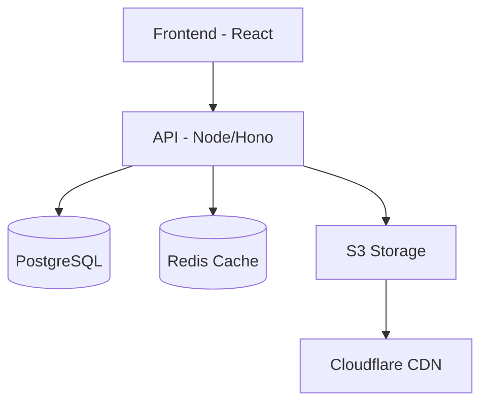

# SHOGUN DOT DEV (PTY) LTD

# ⚔️ Shogun Dot Dev

### Custom software built with craftsmanship, clarity, and care.

  <a href="https://www.shogunn.dev">🌐 Website</a> •
  <a href="https://docs.shogunn.dev">📚 Docs</a> •
  <a href="https://www.linkedin.com/company/shogun-dot-dev/">💼 LinkedIn</a> •
  <a href="https://www.shogunn.dev/careers">🚀 Careers</a>

---

## 🧭 About

Shogun Dot Dev is a modern software company focused on building scalable, high-performance digital products.

> We transform ideas into powerful systems that drive growth.

---

## 📊 GitHub Stats

---

## 🚀 Products

### ⚡ Bucketly

  

Cross-platform S3 file manager with a native desktop experience.

🔗 https://getbucketeer.com/

---

## ⭐ Featured Repositories

- 🔹 Bucketly (Core App)
- 🔹 WashTrack (SaaS Platform)
- 🔹 Internal Tooling APIs

---

## 🛠 Tech Stack

**Frontend**
React • TailwindCSS • ShadCN  

**Backend**
Node.js • C#  

**Infra**
PostgreSQL • Redis • Cloudflare • Railway  

---

## 🧱 Architecture

---

## 🎯 Principles

- Craftsmanship first  
- Performance matters  
- Build for scale  
- Clean architecture  

---

## 🤝 Contributing

Open source coming soon.

---

### ⚔️ Engineered for scale.

